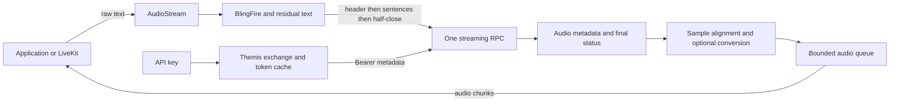

# Internal design

The public client owns credentials and a reusable gRPC connection. Each stream
owns its input writer, audio reader, converter, output queue, and cancellation.
The stream factory validates local options. Network work starts on first use.

## Text and protocol

Python uses standalone `livekit-blingfire` 1.1.0. Node.js uses the pinned Microsoft
WASM build. Neither SDK depends on LiveKit Agents. Python uses the detector's
source offsets. Node.js maps normalized output back to the original text and
accounts for removed zero-width spaces, direction marks, and BOM characters.
Both preserve the original text when they submit sentences.
The buffer schedules scans from Unicode code points, independent of caller chunk
boundaries. It scans at most 1,024 new code points at a time. Possible sentence
punctuation schedules an earlier scan after 16 more code points. These marks
only schedule scans; BlingFire chooses every sentence boundary. A detected
boundary with insufficient following text schedules another scan when the
missing context can arrive. Empty input chunks do not trigger scans.

The last candidate remains pending. The buffer requires 16 following Unicode
code points after trimming whitespace before it commits an earlier sentence.
It retains up to 128 committed code points as detector context and tracks the
submitted offset, so this text is never sent twice. Both implementations count
Unicode code points, including across split UTF-16 surrogate pairs in Node.js.
End of input follows the same scan sequence, then commits the residual once.
The writer half-closes the RPC once.

This guarantees consistent segmentation across caller chunk sizes, not agreement
with a single BlingFire call on the complete document. It also does not correct
BlingFire's language rules. For example, the pinned detector splits `Dr.` from
`Smith` in `Hi! Dr. Smith agrees. Hello.`. Shared fixtures record that limitation
and require the same output for all chunk sizes.

Each operation sends a header, then sentence messages through the canonical
`SynthesizeStreaming` RPC. Complete text uses this same path. There is no
synthesis retry or replay. Read-only discovery retries `UNAVAILABLE` twice
within its original deadline.

## Limits and deadlines

Input is processed in blocks of about 1,024 characters. A pending sentence has
a 65,536-byte UTF-8 limit. Candidate sentences retained for lookahead are checked
separately, so their combined size can exceed one sentence's limit. Retained
history is limited to 128 code points, and up to 1,024 new code points can await
the next scan. The 16-code-point lookahead rule and checks on each candidate span
bound the remaining text. The audio queue holds
at most 96,000 bytes, and a queue entry holds at most 9,600 bytes. gRPC receive
messages have a 4 MiB limit.
Transport buffers and the current converter input are additional bounded storage.
The SDK retains the current application-supplied text chunk while it processes it.
Applications should yield bounded chunks for large input sources.

Internal limits are 10 seconds for authentication, connection, and discovery;
30 seconds before first audio; 60 seconds for stalled output; and 2 seconds for
source cleanup. Source waits and audio backpressure suspend internal output-stall
accounting. They do not suspend an explicit overall timeout.
Discovery uses one deadline across preparation, RPC attempts, and retry delays.
Python passes the remaining time to gRPC for each unary attempt, so gRPC can
retain response headers when the deadline expires. Both SDKs preserve the request
ID on timeout, including a timeout during a retry delay.
The overall timeout starts on stream activation and runs until the consumer
observes successful completion. Timeout and cancellation discard unread audio.

A client has no fixed stream-count limit. Each operation has separate flow
control. A slow operation does not consume another operation's queue capacity.

## Audio

The service path requests raw mono signed 16-bit PCM at 24 kHz. The reader
requires the `audio/pcm` metadata value before delivering bytes and retains partial
sample bytes between messages. If no audio arrives, the reader checks the final
service status before rejecting missing format metadata. Request IDs can come
from headers or trailers; a header ID takes precedence. An incomplete final
sample raises an audio-format error.

PCM passes through without resampling. The mu-law path uses a stateful 63-tap
Hamming-windowed low-pass filter at 3,400 Hz, then downsamples by three and applies
G.711 mu-law. It compensates for filter delay and flushes only after successful
final status. The output contains `ceil(input_samples / 3)` bytes. Shared fixtures
check chunk-independent results. This path still needs listening tests against
real service audio.

## Completion and ownership

Success requires input completion, response EOF, successful final gRPC status,
and converter flush. A final error remains visible after partial audio.
Cancellation wakes blocked readers and writers, cancels the RPC, disposes queued
audio, and closes the text source where supported. It does not cancel sibling
operations. Client shutdown also stops discovery and shared token refresh.
Node.js rechecks failure after taking queued audio and before reporting successful
completion. Python shutdown clears the completed refresh task as well as the
cached token.
Python's stream worker cancels each child once, then allows source cleanup to
finish within its cleanup budget. It cancels remaining work after that budget.

Python callers should use stream async contexts. JavaScript `for await` calls
`return()` on early exit. Manual iterator users must call `cancel()`.
Application sources must cooperate with cancellation. The SDK cannot stop arbitrary
application code that suppresses Python task cancellation or never settles a promise.

LiveKit owns playback and interruption. The external adapter owns PCM frame
construction and framework queues. It forwards raw text, disables synthesis
retries, and cancels old SDK streams. It does not detect sentences.

Python uses the `rime_sdk` logging namespace. Node.js uses `NODE_DEBUG=rime-sdk`.
Diagnostics include operation IDs, request IDs, and byte counts. They do not
include API keys, access tokens, or synthesis text.
