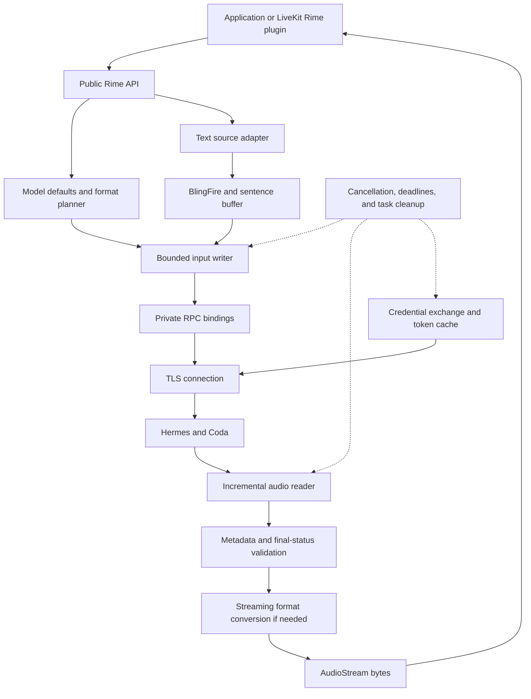

# Rime SDK API and internal design

Updated: 2026-09-17.

This document defines the first-party Rime SDK public API, its internal behavior, and its integration into the LiveKit Rime plugin.

This is a standalone target specification. It includes the API contract, implementation requirements, integration examples, and release acceptance criteria.

## 1. Status and scope

The Python API is the primary contract. Details that need further validation are identified as specification proposals. Service dependencies and open implementation decisions are listed in the release requirements.

The SDK accepts raw incremental text and owns sentence detection. Callers do not select endpoints, manage tokens, supply complete sentences, or configure internal limits.

The first implementation supports Coda through Hermes. Python is async. The JavaScript implementation targets Node.js. Additional models can be added through the same public API. The SDK selects the endpoint and transport for the model.

Public protocol packages remain available for customers who need direct access. The SDK adds authentication, streaming behavior, cleanup, and compatibility above those packages. Generated RPC bindings alone are not the SDK.

Use `uv` for Python environments, dependencies, execution, and packaging.

### 1.1 Repository decision and ownership

Use one dedicated repository, `rimelabs/rime-sdk`, for all first-party SDK implementations. Keep it separate from `rime-api`. The local checkout is `~/Documents/rime-sdk`.

Each language has its own package, dependencies, tests, version, changelog, and release workflow. Shared behavior follows this specification. A shared repository lets reviewers check changes to sentence buffering, cancellation, timeouts, audio formats, and errors across languages in one place.

Use this structure:

```text
rime-sdk/
├── python/                         # rime-sdk; uv project
│   ├── pyproject.toml
│   ├── uv.lock
│   ├── CHANGELOG.md
│   ├── src/rime_sdk/
│   └── tests/
├── typescript/                     # @rimelabs/sdk; Node.js runtime
│   ├── package.json
│   ├── CHANGELOG.md
│   ├── src/
│   └── tests/
├── conformance/                    # Shared cases and expected results
├── docs/
│   └── rime-sdk-api-spec.md         # Version-controlled specification
├── examples/
│   ├── python/
│   └── typescript/
└── .github/workflows/
```

The version-controlled specification in `docs/rime-sdk-api-spec.md` is the source of truth. `~/Documents/rime-sdk-api-spec.md` is a local review copy. Refresh that copy from the repository when the specification changes.

Keep these ownership boundaries:

| Concern | Owner |
| --- | --- |
| Canonical schemas and their publication | Existing schema owners and protocol-package release process |
| Python and TypeScript SDKs | `rimelabs/rime-sdk` |
| Shared behavior, fixtures, and expected results | `rimelabs/rime-sdk/conformance` and this specification |
| LiveKit plugin implementation | LiveKit plugin repository |
| SDK integration examples and compatibility tests | `rimelabs/rime-sdk` |
| Local LiveKit proof of concept | `~/Documents/rime-sdk-livekit-poc` |

Consume the published `rime-api` and `@rimelabs/api` packages. Do not move canonical schemas into the SDK repository or create a second schema release process. Private runtime bindings remain permitted as described in section 11.1.

Use each language's normal tools and conventions. Python uses `uv`. TypeScript has its own package configuration, pinned package manager, and lockfile. Shared behavior does not require shared runtime code or identical language syntax. The Python package belongs in `python/`, not at the repository root.

Separate repositories can be reconsidered if teams need separate ownership, access permissions, or development processes. They are not the current plan.

### 1.2 Shared conformance tests

Store language-neutral test cases and expected results in `conformance/`. Each implementation has a test runner that reads the same cases and maps native results to the shared expectations. Keep language-specific unit, packaging, and runtime tests in each package.

Shared cases must cover:

- Multilingual text, expected sentence boundaries, preserved text, and punctuation-free final phrases.
- The same input as one string, one-character chunks, fixed chunk sizes, and recorded irregular chunks. Include chunk boundaries inside abbreviations, numbers, URLs, and mixed-script text.
- Cancellation, source cleanup, sibling-stream isolation, and suppression of output after cancellation.
- Timeout inheritance, explicit deadline disablement, and expiration during input waits or slow output consumption.
- Audio profiles, sample alignment, conversion continuity, and final-status failures after partial audio.
- Error categories and server request ID propagation.

Use explicit text fragments or a documented Unicode indexing convention for shared chunk boundaries. Do not treat Python character offsets, JavaScript UTF-16 offsets, and UTF-8 byte offsets as interchangeable.

Record expected event order and outcomes for lifecycle cases. Use controlled clocks or bounded timing tolerances instead of requiring identical elapsed times. Define decoding and numerical tolerances for audio cases. Do not require identical encoded bytes unless the contract requires them.

Run both implementations against changed shared cases. A missing TypeScript runner during Python-first development is pending parity work, not a passing conformance check. Service-dependent acceptance tests remain separate from local conformance tests.

### 1.3 Independent checks and releases

Python and TypeScript release independently. A Python packaging fix must not require a JavaScript release. Keep each version in its package metadata, maintain separate changelogs, and use distinct release tags, such as `python-v0.1.0` and `typescript-v0.1.0`.

Each package has its own build, test, and publish workflow. Release automation must track versions and release changes per package. If Release Please is selected, configure separate package entries and versions. Do not use one repository-wide SDK version.

CI selects checks by the affected contract:

| Change | Required checks |
| --- | --- |
| Python-only implementation or packaging | Python lint, type checks, tests, conformance runner, and package build |
| TypeScript-only implementation or packaging | TypeScript lint, type checks, tests, conformance runner, and package build |
| Shared fixtures or specification behavior | Checks and conformance runners for all affected implementations |
| Shared CI or release configuration | Checks for every affected package and workflow |
| LiveKit integration examples or compatibility tests | Python SDK checks and tests against the supported LiveKit version |

A change to public or shared behavior is a contract change even if its first code change is in only one language directory. Path filters must not omit the required cross-language checks. Shared contract changes can require changes in both packages without forcing simultaneous publication.

## 2. Product contract

The ordinary caller provides credentials and text, selects a voice when needed, and consumes audio as it arrives.

The SDK owns:

- Authentication, credential exchange, token caching, and refresh.
- Model routing, TLS, transport connections, and protocol messages.
- Sentence detection and buffering for arbitrary text chunks.
- Concurrent text submission and audio consumption.
- Audio format selection and any required conversion.
- Bounded internal buffering and flow control.
- Timeouts, final-status checks, errors, cancellation, and cleanup.

The application or framework owns:

- Text generation and conversation state.
- How many operations it starts.
- Playback, playback queues, interruption policy, and audio already delivered to it.
- Destination-specific messages, such as Twilio WebSocket envelopes.

The SDK must deliver audio incrementally. A caller can still choose to collect all audio before playback. The SDK cannot prevent that choice or report audio as played merely because it delivered the bytes.

## 3. Public API at a glance

```python
from rime_sdk import Rime

async with Rime() as client:
    async with client.tts.stream("Hello.") as audio:
        configure_player(audio.format)
        async for chunk in audio:
            await play(chunk)
```

`configure_player` and `play` are application functions. They are not SDK functions. The SDK does not open a speaker device.

| Public name | Purpose |
| --- | --- |
| `Rime` | Reusable async client |
| `client.tts.stream(...)` | One synthesis operation with complete or incremental text |
| `client.voices.list(...)` | Voice identifiers for the selected model |
| `client.languages.list(...)` | Language codes for the selected model |
| `client.close()` | Close the client and its active operations |
| `AudioStream` | Async context manager and async iterator of `bytes` |
| `audio.format` | Read-only description of the returned audio |
| `audio.request_id` | Read-only server request ID, when available |
| `audio.cancel()` | Stop one operation |
| `AudioFormat` | Named supported output profiles |
| `RimeError` and subclasses | Public failure types |

There is no public session constructor, sentence submission method, token provider, transport selector, or completion-result method.

## 4. Client construction and lifetime

```text
Rime(
    *,
    api_key: str | None = None,
    model: str = "coda",
    timeout: float | None = None,
)
```

| Option | Default | Meaning |
| --- | --- | --- |
| `api_key` | Read `RIME_API_KEY` | Credential for authenticated Rime access |
| `model` | `"coda"` | Select the model and its internal routing |
| `timeout` | `None` | Default overall operation deadline, in seconds |

An explicit API key takes precedence over the environment. Missing credentials fail before a network request. An explicitly empty key is invalid. Do not silently replace it with a different credential.

The SDK reads environment variables. It does not automatically find or load `.env` files. An application can use `python-dotenv` before it creates the client:

```python
from dotenv import load_dotenv
from rime_sdk import Rime

load_dotenv()
client = Rime()  # Reads RIME_API_KEY from the process environment.
```

All production traffic requires authentication and TLS with certificate validation. There is no caller option to disable either.

The client can serve concurrent synthesis operations without a fixed SDK limit on active operations per client. Applications control workload concurrency. Server capacity limits still apply, and internal buffers remain bounded.

The Python client belongs to one event loop. Reuse it across tasks on that loop. Do not share it across processes or event loops. This is a specification proposal for the Python runtime contract.

`await client.close()` is idempotent. It rejects new operations, cancels opening and active operations, releases connections, and clears cached credentials. It does not wait indefinitely for synthesis to finish. `async with Rime(...)` calls `close()` on exit. A closed client cannot be reopened.

## 5. Synthesis

### 5.1 Signature

```text
client.tts.stream(
    text: str | AsyncIterable[str],
    *,
    voice: str | None = None,
    language: str = "en",
    audio_format: AudioFormat | None = None,
    timeout: float | None = <inherit client setting>,
) -> AudioStream
```

This is a signature description. `<inherit client setting>` is not Python syntax. The implementation uses a private sentinel to distinguish an omitted timeout from an explicit `None`. Callers never import that sentinel.

`stream(...)` is a synchronous factory for an async stream handle. It is not awaited. Network work and source consumption start when the handle is entered or first iterated. Validation that requires no I/O can fail at construction.

| Option | Behavior |
| --- | --- |
| `text` | Complete text or an async iterable that yields text chunks |
| `voice` | Optional. Coda resolves omission to `"clementine"` |
| `language` | Defaults to `"en"`. Omission means English, not automatic detection |
| `audio_format` | Optional. Select a supported named output profile |
| `timeout` | Omission inherits the client setting. `None` disables the overall deadline |

`voice` selects the synthesis voice. Internally, the model adapter maps it to the protocol's speaker field. Synthesis options are direct keyword arguments.

A new model must define its default voice, supported formats, endpoint, and internal policy before the SDK accepts its model name. An unknown model produces a clear input error. It must not silently route to Coda.

### 5.2 Complete and incremental text use the same path

```python
# Complete input.
audio = client.tts.stream("Hello. How can I help?", voice="clementine")

# Incremental input, such as an LLM text iterator.
audio = client.tts.stream(llm_text_chunks, voice="clementine")
```

```text
String --------> one text chunk, then end of input --+
                                                    +--> sentence buffer
Async iterable -> text chunks, then end of input ----+          |
                                                               v
                                                      one synthesis session
                                                               |
                                                               v
                                                       incremental audio
```

A string must be treated as one input chunk. Do not accidentally iterate over its characters as the input source. Both input forms pass through the same sentence and audio lifecycle.

For Coda, use one `SynthesizeStreaming` RPC for this shared path. The public API does not expose the distinction between unary-input and bidirectional RPCs. A future internal optimization may use a different RPC only if it preserves the documented behavior and passes equivalence tests.

There is no public `stream_text`, `stream_sentences`, `session`, `send_sentence`, or `finish_input`. An adapter that already has complete sentences can yield those strings into `stream`. It does not need a separate entry point. Avoid unnecessary sentence aggregation in the adapter.

### 5.3 Input rules

- Preserve text order. Do not insert spaces between arbitrary incoming chunks.
- Empty chunks do not submit empty sentence messages. Preserve meaningful whitespace between text fragments.
- Empty or whitespace-only complete input is invalid. An incremental source that ends without meaningful text also fails clearly.
- Each yielded item must be a string. A source exception stops synthesis and is retained through exception chaining.
- Source exhaustion is end of input. A pause is neither a sentence boundary nor end of input.
- The SDK consumes only as far ahead as its bounded input capacity permits.
- Cancellation stops the SDK's producer task. Close the acquired iterator with `aclose()` when supported. External tasks that feed that iterator still belong to the application.

The empty-input and source-failure details are specification proposals. They must be consistent in Python and Node.js.

## 6. Audio stream contract

```text
AudioStream:
    format: AudioFormat                 # read-only
    request_id: str | None              # read-only
    async iterator yielding bytes
    async context manager
    async cancel() -> None
```

`AudioStream` is returned by the SDK. Applications do not instantiate it directly. It has one audio consumer. Concurrent reads from the same handle are invalid. A handle represents one operation and cannot be replayed or restarted.

`audio.format` is available when the context opens, before the first audio chunk. Format resolution must not wait for a sentence or first audio. The SDK validates server format metadata before it releases audio bytes. A mismatch fails the operation.

`audio.request_id` is `None` until the server supplies an ID. It remains available after success, failure, or close. Do not invent a server ID when none was received.

Iteration yields `bytes`, not `AudioChunk(data=...)`. Transport message boundaries have no public meaning. A chunk is not necessarily one sentence, one playback frame, or one audio file.

Specification proposal: for raw PCM, yield complete sample frames. Keep any partial sample bytes internally until the next transport message. Reject an incomplete final sample frame. The SDK does not promise fixed-duration chunks. LiveKit can create its own 20 ms frames.

### 6.1 Success and failure

Normal iterator exhaustion means all of the following:

1. The input source completed successfully.
2. The SDK sent the final text and ended input once.
3. The server ended audio with a successful final status.
4. Any format converter completed successfully.
5. The caller consumed the output.

Input half-close, output EOF without a final status, and partial audio are not sufficient proof of success. A non-success status raises from iteration even if earlier chunks reached the caller. There is no `audio.result()` or public `Completion` record.

If the caller stops reading, it has not observed successful completion. Use the context manager to clean up unfinished work:

```python
async with client.tts.stream(text) as audio:
    async for chunk in audio:
        if should_stop():
            break
        await play(chunk)
```

A bare `break` outside a managed lifetime is not a cleanup contract. Use `finally: await audio.cancel()` when not using `async with`.

### 6.2 Cancellation

`await audio.cancel()` stops input processing, discards unread SDK output, cancels the RPC, and prevents subsequent delivery from that stream. It is safe before startup, during startup, during streaming, and after termination. Repeated calls are safe. It does not close sibling streams or their shared client.

Specification proposal: an active reader or a later read on an explicitly cancelled operation raises `RimeCancelledError`. Cancelling the caller's Python task retains `asyncio.CancelledError`. Context exit cleans up quietly when the caller intentionally leaves early. Calling `cancel()` after success does not replace success with cancellation.

Cancellation confirms local cleanup. It does not claim a server acknowledgment, release of server capacity, or removal of audio already in a playback queue. Those require separate framework behavior and service tests.

## 7. Audio formats

Use named `AudioFormat` values. Callers do not independently combine encoding, sample rate, and channels.

```python
from rime_sdk import AudioFormat

audio = client.tts.stream(text)  # Coda default: PCM at 24,000 Hz, mono.
audio = client.tts.stream(text, audio_format=AudioFormat.MULAW_8000)
```

The following named output profiles and read-only properties define the proposed v1 format set:

| Member | `encoding` | `sample_rate` | `channels` |
| --- | --- | --- | --- |
| `AudioFormat.PCM_24000` | `"pcm_s16le"` | `24000` | `1` |
| `AudioFormat.MULAW_8000` | `"mulaw"` | `8000` | `1` |

`audio.format` returns the effective immutable `AudioFormat` value. Its properties describe the actual output bytes. `PCM_24000` has no WAV header. `MULAW_8000` is raw G.711 mu-law audio with no container or provider envelope. Each advertised profile must pass the format acceptance tests. Add other profiles only when their conversion paths are implemented and verified.

No public `content_type` field is needed. The SDK still validates internal MIME metadata. No generic `telephone=True` or provider-specific `output="twilio"` option is provided.

### 7.1 Where conversion happens

The internal format planner chooses a verified service format and any needed conversion. Prefer a tested server output path when available. Otherwise, use an internal streaming converter. The caller receives the requested supported profile in either case.

If conversion is needed, preserve resampler and encoder state across chunks. Filter before downsampling. Flush the converter only after successful input completion, and propagate converter failures. Bound intermediate buffers. Never collect the entire utterance to convert it. Never change a sample-rate label without converting the samples.

Before advertising `MULAW_8000`, verify 8 kHz mu-law output through the supported Hermes route or implement a tested SDK conversion path. Accepting a MIME type in a service request does not prove that the resulting audio matches the requested profile. The converter library and choice between server and SDK conversion remain implementation decisions.

### 7.2 Telephone use

Traditional narrowband connections commonly use 8,000 Hz G.711 mu-law or A-law. Wideband connections can use 16,000 Hz audio. The connection's negotiated codec controls the requirement. See [LiveKit's codec documentation](https://docs.livekit.io/reference/telephony/codecs-negotiation/).

Twilio bidirectional Media Streams specifically require 8,000 Hz mono mu-law, base64 encoded inside Twilio messages. The SDK supplies raw audio bytes. A Twilio adapter creates those messages and handles its mark and clear events. See [Twilio's message contract](https://www.twilio.com/docs/voice/media-streams/websocket-messages#send-a-media-message).

For a LiveKit telephone agent, the Rime plugin requests PCM. LiveKit's media and SIP layers handle the telephone codec. The application should not select mu-law merely because the room has a telephone participant.

## 8. Timeouts

All public timeout values are seconds. `None` means no overall SDK deadline. A numeric timeout must be finite and greater than zero.

```python
client = Rime(timeout=30)

client.tts.stream(text)                # Inherit 30 seconds.
client.tts.stream(text, timeout=10)    # Use 10 seconds.
client.tts.stream(text, timeout=None)  # No overall deadline.
```

The deadline begins when an operation starts executing. For synthesis, this is context entry or first iteration. Creating an unused handle does not start the clock. For discovery, it starts when the method executes.

The overall budget includes credentials, connection setup, text-source waits, synthesis, conversion, and output consumption. It includes intentional caller pauses. A deadline watcher must cancel an operation even when the caller is not currently asking for the next audio chunk. The next relevant await reports `RimeTimeoutError`.

The SDK cannot preempt arbitrary application code such as a playback function. It can cancel its own work and report expiration. A blocked Python event loop also delays timer processing.

Internal timers remain active even when the overall deadline is disabled:

| Internal timer | Required behavior |
| --- | --- |
| Authentication | Bound credential acquisition and refresh waits |
| Connection | Bound connection establishment |
| First audio | Start when enough text has been submitted for synthesis; exclude consumer-imposed read suspension |
| Output progress | Detect a service stall when output is expected; account for input pauses and output backpressure |
| Discovery | Bound a discovery attempt and the complete internal retry budget |

Select internal timeout values per model and validate them against service behavior. Keep these values in internal policy. They are not public configuration or fixed promises for every model.

Do not impose a fixed post-input completion deadline independent of the caller's overall timeout. Long output and slow playback are valid. Use progress-aware handling. With no server progress signal, a lack of audio can be ambiguous. The implementation must avoid classifying legitimate input pauses or backpressure as server failures. Exact stall thresholds and observations need model tests.

`timeout=None` does not override independent service or network limits. The SDK must report such failures clearly.

## 9. Discovery

```text
await client.voices.list(
    language: str | None = None,
    *, timeout: float | None = <inherit client setting>,
) -> list[str]

await client.languages.list(
    *, timeout: float | None = <inherit client setting>,
) -> list[str]
```

Both methods query the client's selected model and use the same public timeout semantics as synthesis.

`voices.list()` returns all voice identifiers available for that model. `voices.list(language="en")` filters by language. Each identifier can be used as `voice` in synthesis. A voice can have language restrictions. Listing all voices does not promise that every voice supports every language.

`languages.list()` returns supported language codes usable as `language` in synthesis. The server owns catalog contents and language validation. Do not copy a permanent language allowlist into the SDK. The explicit SDK default remains `"en"`.

The discovery result is a snapshot. Availability can change between discovery and synthesis. No public discovery-specific timeout or cache-control setting is required.

## 10. Errors

Use `RimeError` as the common base and specific subclasses for failure categories. The following hierarchy defines the proposed v1 error taxonomy:

| Exception | Meaning |
| --- | --- |
| `RimeError` | Common base for SDK and Rime operation failures |
| `RimeAuthenticationError` | Missing, invalid, or expired credentials |
| `RimePermissionError` | Authenticated caller lacks permission |
| `RimeInputError` | Invalid model, text, voice, language, options, or failed text source |
| `RimeResourceLimitError` | Service capacity or internal resource limit exceeded |
| `RimeUnavailableError` | Service or connection unavailable |
| `RimeTimeoutError` | Overall or internal deadline expired |
| `RimeAudioFormatError` | Unsupported requested profile, unexpected output, or conversion failure |
| `RimeCancelledError` | Explicit local stream or client cancellation |
| `RimeStreamError` | Other stream or protocol failure, including premature server completion |

All SDK-defined subclasses carry a clear message and `request_id: str | None`. `str(error)` returns the message. Transport details and secret-bearing server text must not leak into ordinary error messages.

Native Python argument-binding errors can still raise `TypeError`. External task cancellation remains `asyncio.CancelledError`. The SDK should not wrap those as generic service failures.

```python
from rime_sdk import RimeAuthenticationError, RimeError, RimeTimeoutError

try:
    async with client.tts.stream(text) as audio:
        async for chunk in audio:
            await play(chunk)
except RimeAuthenticationError:
    report_configuration_error()
except RimeTimeoutError as error:
    report_timeout(error.request_id)
except RimeError as error:
    report_synthesis_failure(str(error), error.request_id)
```

The report functions are application functions. The example deliberately does not retry speech.

Use standard Python exception chaining, such as `raise RimeTimeoutError(...) from original_error`. There is no custom public `cause` field. The underlying exception can appear in a traceback, but its transport-specific type is not a stable SDK contract.

### 10.1 Internal error information

Keep these values private for diagnostics:

- `operation_id`: SDK-generated correlation ID, available before a server request ID exists.
- `phase`: SDK step where a failure was detected. It is not necessarily the root cause.
- `grpc_status`: original transport status.
- `acceptance_unknown`: whether server acceptance cannot be established after a failure.
- Byte counters and internal timing measurements.

There are no public `bytes_received`, `bytes_delivered`, `elapsed_seconds`, `phase`, `grpc_status`, `operation_id`, `acceptance_unknown`, or `kind` fields on streams or errors.

`UNAVAILABLE` must not automatically become a rate-limit error. Use the actual service contract to interpret capacity failures. The SDK must report partial-audio failures as failures.

## 11. Internal architecture



These responsibilities can share implementation files. They do not require a public plug-in system or a class for every box.

### 11.1 Protocol packages and routing

Package names are `rime-sdk` for Python, imported as `rime_sdk`, and `@rimelabs/sdk` for Node.js. Public schema packages are `rime-api` and `@rimelabs/api`.

Use the canonical schema messages and serialization. Private runtime bindings can be generated or derived from service descriptors. Do not publish a second incompatible set of message classes inside the SDK.

The first Python runtime uses `grpc.aio`. The Node.js plan uses `@grpc/grpc-js`. These are internal choices. Route Coda to `coda.api.rime.ai:443` over TLS through internal model configuration. It is not a constructor option.

Keep the model's route, default voice, default output profile, supported conversion paths, and internal timeout policy in one internal definition. Do not expose raw metadata injection, stable/canary selection, custom endpoints, TLS disablement, or trusted CA overrides in v1. Test doubles and private test configuration can exercise routing without adding public options.

No legacy HTTP or WebSocket fallback is part of this SDK release. Public protocols remain supported separately according to their own service lifecycle.

### 11.2 Authentication

The desired customer credential is an API key. The SDK performs any required exchange internally. Production Hermes token issuance depends on the Themis service contract.

Do not send an API key directly as a bearer token. For this local implementation, assume Themis is complete and use the private exchange contract in [authentication](authentication.md), as requested. Its endpoint, audience, expiry, and refresh behavior are explicit implementation assumptions until deployment validation. They are not public SDK options.

For token-based access, the implementation must:

1. Resolve the API key and validate that it is present.
2. Obtain a token through the service's documented exchange.
3. Cache the token in memory with its expiry and audience.
4. Share one in-flight refresh among concurrent operations for the same credentials.
5. Obtain a valid token before each new RPC.
6. Attach authentication metadata without logging the credential.

Refreshing credentials must not restart an active synthesis. If a caller waiting for a shared refresh is cancelled, it must not disrupt unrelated operations. Client shutdown must still release owned authentication tasks. Cache entries must not cross credential identities or audiences.

There is no public `AccessToken`, `TokenProvider`, `token_provider`, or `allow_unauthenticated`. Production calls always authenticate. Private test services can simulate authentication without live secrets.

### 11.3 BlingFire and sentence buffering

BlingFire is the selected sentence detector. Python uses native bindings. JavaScript uses a WebAssembly build. Pin compatible engine and sentence-rule data versions, then run the same text fixtures in both implementations.

Reuse the detector. Implement only the incremental buffering, lifecycle, and flow-control behavior needed by the SDK. Do not make LiveKit Agents a dependency of the Rime SDK just to obtain a tokenizer.

The detector operates on available text. Its final span can be incomplete because the input chunk ended. The buffer must retain uncertain trailing text and obtain enough context before it commits a boundary. A period can be part of an abbreviation, number, or URL. Never treat every LLM chunk boundary as a sentence boundary.

For the same text, sentence messages must be independent of caller chunk sizes.
Use a deterministic incremental scan sequence with bounded detector context.
The result need not match one detector call on the complete document. BlingFire
still chooses sentence boundaries; the SDK does not add language-specific rules.

Use offsets to preserve the original text where the chosen binding provides them. Avoid unwanted normalization, punctuation insertion, or whitespace loss. Test offset handling across UTF-8 and JavaScript UTF-16 representations.

At true end of input, submit the remaining non-empty text once, then half-close. Test punctuation-free final phrases through Hermes. That behavior is required for useful incremental input but still needs service verification.

Bound unfinished text and queued sentences. A long complete string can contain many valid sentences; do not apply a per-sentence limit to the entire string merely because it arrived in one chunk. Process large inputs incrementally. If one unsplittable sentence exceeds a supported limit, raise a clear input or resource error. Do not split it at an arbitrary byte count.

The standard BlingFire sentence API does not accept the SDK's language argument as a language selector. `language` selects synthesis behavior. Do not claim that passing `language="en"` configures an English-specific BlingFire model. Language-specific tailoring would require separate internal support and tests.

BlingFire does not establish perfect coverage for all languages. Test every advertised Rime language, mixed-language text, decimals, abbreviations, URLs, quotes, newlines, non-Latin punctuation, and punctuation-free endings. Compare both sentence accuracy and delay before submission.

Microsoft documents Python and JavaScript support, but labels the JavaScript integration as work in progress. Validate build, package size, startup time, supported runtimes, and Unicode behavior before release. See [BlingFire](https://github.com/microsoft/BlingFire).

### 11.4 Coda wire lifecycle

The canonical service is `rime.TextToSpeech`. For the shared synthesis path:

1. Open one `SynthesizeStreaming` RPC.
2. Send exactly one header with voice, language, audio parameters, and internal model settings. Header text can be empty.
3. Submit complete sentences as `text_chunk` messages in order.
4. Read audio concurrently with writes.
5. Submit the final residual text once when the source ends.
6. Half-close input once.
7. Drain audio, validate final status, and finish conversion.

Do not wait for response metadata or audio before permitting input writes. That can deadlock a service that waits for text before responding.

The schema reserves the old `flush` field. There is no sentence-flush RPC message. Input pauses do not close the operation. A successful local write does not prove that the server accepted or synthesized the text.

Keep one RPC across sentences. Coda owns its internal generation rollover and model context. Do not create a new RPC for each sentence or prepend already-submitted text.

`text_lookahead_tokens` is internal. Start from a verified model default and tune through tests. Preserve the difference between omission and explicit zero in the wire request. Other model sampling options and split strategy are also internal unless a future public requirement establishes them.

Discovery maps to `GetSupportedSpeakers` and `GetSupportedLanguages`. `NormalizeText` is not part of the v1 SDK API.

### 11.5 Audio validation

Set the requested MIME format and sample rate explicitly on the wire. Validate `x-rime-audio-content-type` before yielding payload bytes. Keep MIME handling internal.

The current engine can fall back to WAV for an unknown MIME type. The SDK must reject unexpected output rather than label WAV bytes as raw PCM. Do not request `audio/l16` as the public little-endian PCM contract; that MIME type has different byte-order semantics.

The current response does not independently confirm every audio property. Separate configured properties from metadata evidence internally. Service tests must establish sample rate, channel count, encoding, and conversion behavior.

No word timing or measured text alignment is available from the current audio-only gRPC response. Do not invent timestamps. Framework capabilities must reflect this limit.

### 11.6 Flow control and memory

Use bounded input and output buffering. Account for bytes, in-flight work, protocol runtime buffers, tokenizer state, and converter state. A slow audio consumer must stop read-ahead; exhausted input capacity must stop source advancement.

The SDK must not retain the whole utterance for retry or diagnostics. It cannot bound memory already allocated by the caller or retained inside the caller's source.

Per-sentence and receive-message limits remain internal. Derive them from supported service limits and measured memory requirements. There is no fixed per-client operation cap. Bounded per-operation memory does not imply bounded total memory for an unlimited number of application-created operations.

Keep cancellation and final-status handling responsive under backpressure. A blocked consumer on one operation must not prevent another operation from progressing. Validate these behaviors under concurrent load.

### 11.7 Retry and reconnection

Do not automatically replay synthesis, including attempts that delivered no audio. A server can accept work before the client sees any output. The current schema provides no resume cursor, output acknowledgment, or deduplication key.

The connection can recover for future operations. A failed operation is not resumed. Never retry anonymously after authentication fails.

Discovery is read-only and can use bounded retries for transient failures. All attempts and delays share the effective deadline. With no caller deadline, an internal discovery budget still bounds retries. Define an internal attempt limit and backoff policy based on service behavior.

### 11.8 Diagnostics

Use standard logging. The library must not configure application-wide handlers. No public `on_diagnostic` callback or `DiagnosticEvent` type is retained.

Internal logs can correlate operation IDs, request IDs, failure phases, transport status, counters, and timings. Default SDK logs must exclude input text, audio payloads, API keys, tokens, and unfiltered metadata. Chained exceptions are for debugging and must also be reviewed for secret exposure.

Use a consistent monotonic operation start for internal measurements. Measure separate events such as first text received, first sentence submitted, first audio received, and first audio delivered. Sentence-buffer delay is distinct from server synthesis latency. None of these measurements proves playback time.

A dedicated public metrics or tracing API is deferred. LiveKit can retain its own framework metrics without an SDK diagnostic callback.

## 12. LiveKit Rime plugin replacement

### 12.1 Target integration

The `livekit.plugins.rime.TTS` implementation calls the first-party SDK. The plugin adapts LiveKit text and audio lifecycles to the SDK. Its implementation contains no independent Rime transport client.

```text
LiveKit AgentSession and LLM
        |
        | raw text chunks
        v
Rime TTS plugin
        |
        | client.tts.stream(async_text_source, ...)
        v
Rime SDK: sentences, authentication, RPC, audio, cancellation
        |
        | PCM bytes
        v
Rime TTS plugin: bounded delivery and LiveKit audio frames
        |
        v
LiveKit playback and optional SIP connection
```

The plugin must not contain Rime HTTP requests, WebSocket protocols, gRPC bindings, token refresh, Coda sentence detection, or server-format negotiation. It requests a supported SDK audio profile and adapts the result to LiveKit.

### 12.2 Responsibilities

| Concern | Owner |
| --- | --- |
| LLM generation, turns, interruption decisions | LiveKit agent |
| Accept pushed text and expose an async text source | LiveKit Rime plugin |
| Sentence detection and final residual text | Rime SDK |
| Authentication and network protocol | Rime SDK |
| PCM sample alignment and declared format | Rime SDK |
| Fixed-duration LiveKit audio frames | Plugin and LiveKit AudioEmitter |
| Bounded queues between SDK and actual LiveKit consumer | Plugin and LiveKit integration |
| Telephone codec negotiation | LiveKit SIP layer |
| Clear already-delivered playback audio | LiveKit playback layer |
| Stop synthesis and suppress subsequent SDK bytes | Rime SDK |

Both LiveKit entry points use the same SDK method:

| LiveKit method | SDK call |
| --- | --- |
| `synthesize(text)` | `client.tts.stream(text, ...)` |
| `stream()` plus text pushes | `client.tts.stream(async_text_chunks, ...)` |
| Stream `aclose()` | Cancel its SDK stream and release adapter tasks |
| Plugin `aclose()` | Close plugin streams; close the SDK client only if the plugin owns it |

### 12.3 Proposed application usage

The following constructor is the proposed plugin API for this design.

```python
from livekit.agents import AgentSession, inference
from livekit.plugins import rime, silero

provider = rime.TTS(
    model="coda",
    voice="clementine",
    language="en",
)

session = AgentSession(
    vad=silero.VAD.load(),
    stt=inference.STT("deepgram/nova-3", language="en"),
    llm=inference.LLM("openai/gpt-4.1-mini"),
    tts=provider,
)
```

The plugin creates and owns `Rime(model="coda")`. It reads the API key through the SDK's environment fallback. It requests `AudioFormat.PCM_24000`, declares `sample_rate=24000` and one channel to LiveKit, and sets `streaming=True`, `aligned_transcript=False`.

Support client injection for applications that share a client:

```python
from rime_sdk import Rime
from livekit.plugins import rime

client = Rime()
provider = rime.TTS(client=client, voice="clementine", language="en")

# Application shutdown, after the agent stops using the provider:
await provider.aclose()
await client.close()
```

An injected client is borrowed. The plugin never closes it. An internally created client is owned and closes with the plugin. Avoid an ownership boolean in the normal application API. Reject conflicting client construction options when an existing client is supplied.

Use one fixed PCM output profile for a plugin instance. The declared LiveKit sample rate and channel count must match the bytes for every operation. A future model must support that profile directly or through SDK conversion before this plugin can use it.

### 12.4 Plugin implementation sketch

The following code shows the SDK calls inside a replacement plugin using the LiveKit 1.8.2 `_run(output_emitter)` structure. It is an integration sketch, not a complete module. The bounded input and output helpers are private plugin infrastructure with the contracts described after the code. Adapt framework hooks to the LiveKit version supported by the plugin.

```python
import asyncio
import logging
from dataclasses import replace

from livekit.agents import APIError, tts, utils
from rime_sdk import AudioFormat, RimeError

logger = logging.getLogger(__name__)


async def _forward_sdk_audio(owner, text_source, emitter, *, streaming):
    # owner._provider is the Rime plugin instance.
    # owner._output is a bounded adapter output helper.
    provider = owner._provider
    audio = provider._client.tts.stream(
        text_source,
        voice=provider._voice,
        language=provider._language,
        audio_format=AudioFormat.PCM_24000,
    )
    owner._sdk_audio = audio

    # This is a LiveKit correlation ID, not a Rime server request ID.
    local_id = utils.shortuuid()
    try:
        async with audio:
            fmt = audio.format
            if fmt != AudioFormat.PCM_24000:
                raise APIError("Unexpected SDK audio format", retryable=False)

            emitter.initialize(
                request_id=local_id,
                sample_rate=fmt.sample_rate,
                num_channels=fmt.channels,
                mime_type="audio/pcm",
                frame_size_ms=20,
                stream=streaming,
            )
            if streaming:
                emitter.start_segment(segment_id=local_id)

            async for chunk in audio:
                # Await capacity that includes AudioEmitter and downstream
                # queues. emitter.push() alone does not supply backpressure.
                await owner._output.push(emitter, chunk)

            # Normal iteration already checked final Rime status.
            if streaming:
                emitter.end_segment()
    except asyncio.CancelledError:
        raise
    except RimeError as error:
        raise APIError(
            f"Rime synthesis failed: {error}; request_id={error.request_id}",
            retryable=False,
        ) from error
    finally:
        # Releases unfinished work if a plugin helper failed or was cancelled.
        await audio.cancel()
        logger.debug(
            "Rime synthesis association",
            extra={
                "livekit_request_id": local_id,
                "rime_request_id": audio.request_id,
            },
        )


class SynthesizeStream(tts.SynthesizeStream):
    # Constructor responsibilities:
    # - create bounded input and output helpers;
    # - set self._provider and self._sdk_audio = None;
    # - call the base constructor with max_retry=0;
    # - register the stream for provider shutdown.

    async def _run(self, output_emitter):
        # The input helper yields raw strings unchanged. It performs no
        # sentence splitting. end_input() ends this iterator.
        await _forward_sdk_audio(
            self, self._input.iter_text(), output_emitter, streaming=True
        )

    async def push_text_async(self, text):
        await self._input.put(text)

    def push_text(self, text):
        # Synchronous compatibility path. Fail clearly if capacity is full.
        self._input.put_nowait(text)

    async def aclose(self):
        self._input.cancel()
        self._output.cancel()
        if self._sdk_audio is not None:
            await self._sdk_audio.cancel()
        await super().aclose()


class ChunkedStream(tts.ChunkedStream):
    # Constructor responsibilities are the same, except that input_text is
    # already complete and no pushed-text helper is needed.

    async def _run(self, output_emitter):
        await _forward_sdk_audio(
            self, self._input_text, output_emitter, streaming=False
        )
```

Each constructor must use `replace(conn_options, max_retry=0)` when it calls the LiveKit base constructor. Returned LiveKit errors must also be non-retryable. Do not allow a framework retry loop to replay a failed synthesis behind the SDK.

The complete plugin must preserve LiveKit metrics setup, text accounting, output iteration, context management, final-frame behavior, and task registration. The sketch intentionally omits that version-specific code. In particular, it is not sufficient to override `push_text` without preserving the framework's metrics behavior.

The local correlation ID permits emitter initialization before server metadata exists. Record the real Rime ID separately when it arrives. Do not fabricate it or expose the SDK's private operation ID. A supported LiveKit tracing hook can also attach the real provider ID.

### 12.5 Required private plugin helpers

The input helper must bound queued UTF-8 bytes. Awaitable pushes wait for capacity. Synchronous pushes fail on overflow rather than silently dropping text or growing an unlimited queue. Closing or cancelling the stream wakes blocked producers. Choose a byte budget from latency and memory tests, then keep it internal.

The output helper must count audio until the actual LiveKit audio consumer reads it. Counting only writes into `AudioEmitter` is insufficient because the emitter and framework event queues can buffer further. Small frame-sized writes help keep that accounting accurate. Set and test an internal duration or byte budget, including in-flight work.

At 24,000 Hz, mono signed 16-bit PCM, a 20 ms frame contains 480 samples and 960 bytes. The plugin's frame assembler must preserve sample order and handle the final partial-duration frame. No full-utterance collection is allowed.

Do not retain text for synthesis replay. Audit framework metrics strings, tracing text, and iterator tee buffers separately. Bounding one queue does not establish a bound for the complete pipeline.

### 12.6 End of input and flush

For the intended AgentSession path, one LiveKit stream represents one utterance. `end_input()` ends its async text source. The SDK handles the final residual phrase and half-close.

LiveKit's base `flush()` marks a segment boundary. Treating it as a no-op can violate the framework contract. The plugin must document supported segment behavior and test it against the selected LiveKit version.

Never translate a framework flush into a nonexistent Rime wire flush, and never submit an incomplete phrase merely because the producer paused. Applications requiring multiple independent segments should create separate LiveKit synthesis streams. The exact treatment of direct mid-stream `flush()` calls is an open plugin compatibility decision.

### 12.7 Interruption and shutdown

On interruption, stop input forwarding, cancel the SDK stream, discard queued plugin output, and suppress later events from that utterance. LiveKit separately clears already-delivered playback audio. A new utterance can reuse the same SDK client.

Plugin shutdown closes all owned stream handles. It then closes its SDK client only if it created that client. Borrowed clients and unrelated operations remain active.

### 12.8 Framework input backpressure

The framework text-forwarding loop needs an awaitable path to the plugin's bounded input buffer. One integration pattern is:

```python
push_async = getattr(stream, "push_text_async", None)
if push_async is not None:
    await push_async(chunk)
else:
    stream.push_text(chunk)
```

`push_text_async` in this example is a proposed integration hook, not an assumed LiveKit API. Use an upstream-supported awaitable input path or a documented extension compatible with the supported LiveKit version. Without it, a synchronous producer cannot wait for capacity; it must receive a clear overflow error.

### 12.9 Replacing the existing plugin safely

A plugin release that replaces HTTP or WebSocket implementations must account for their supported models and options. The initial SDK scope is Coda. It must not imply support for every legacy capability.

Move the supported Coda path to SDK calls and remove protocol ownership from that path. Do not silently map unsupported legacy model or tuning options to Coda. Use a documented release migration, with aliases such as `speaker` to `voice` where appropriate, or a major plugin release when required. Keep legacy support outside the new SDK until its replacement exists.

A replacement is complete only when the plugin's advertised model and option support matches what the SDK implements.

### 12.10 Local proof of concept and repository boundary

Implement the new Python SDK in `~/Documents/rime-sdk/python`. Update the editable dependency in `~/Documents/rime-sdk-livekit-poc` from `../rime-sdk-poc` to `../rime-sdk/python`.

Keep local plugin patches and framework changes in the proof of concept while compatibility work is in progress. Move the final plugin implementation into the LiveKit plugin repository. The SDK repository can contain examples and integration tests, but it must not become the owner of a second LiveKit plugin implementation.

Update the proof-of-concept configuration, agent, smoke tests, interruption tests, and patch checks to use the public API in this specification. Remove reliance on the old public session, token-provider, transport, diagnostic-callback, and completion-result APIs. Keep service-contract gaps explicit; do not restore unauthenticated production access to make the proof of concept pass.

## 13. Node.js parity

Use the same concepts: `Rime`, `tts.stream`, named audio formats, text as a string or async iterable, incremental bytes, request ID, cancellation, and typed errors. Use BlingFire WebAssembly with the shared sentence test corpus.

The TypeScript implementation lives in `typescript/` and publishes `@rimelabs/sdk`. Its tests use `conformance/` alongside the Python tests. It has its own dependencies, version, changelog, and release workflow. Python-first implementation does not remove the Node.js parity requirement.

The following spelling is a proposal for the Node.js API. Camel-case fields and cleanup syntax require a JavaScript API review. Timeout units are seconds in this proposal.

```typescript
import { Rime, AudioFormat } from "@rimelabs/sdk";

const client = new Rime({ model: "coda", timeout: null });
const audio = client.tts.stream(llmTextChunks, {
  voice: "clementine",
  language: "en",
  audioFormat: AudioFormat.PCM_24000,
});

try {
  for await (const chunk of audio) {
    await output.write(chunk); // Uint8Array; output is application-owned.
  }
} finally {
  await audio.cancel();
  await client.close();
}
```

In this proposal, omitted operation timeout inherits the client value and explicit `null` disables the deadline. `output.write` stands for an awaitable sink that honors backpressure. Node.js `Writable.write()` itself returns a boolean and must use its normal drain handling.

Do not promise browser execution for the initial native-gRPC Node.js SDK. Browser transport and browser-safe credential handling require separate design work. Equivalent behavior across Python and JavaScript does not require copying Python context-manager syntax.

## 14. Public and internal API boundary

| Concern | Public contract | Internal implementation |
| --- | --- | --- |
| Client | `Rime(api_key, model, timeout)` | Credentials, model policy, connections |
| Authentication | API key and environment fallback | Token exchange, cache, refresh, expiry |
| Routing | Model name | Endpoint, transport, TLS, certificate validation |
| Text | String or async iterable of strings | BlingFire, sentence buffer, input writer |
| Synthesis | `tts.stream(...)` | Session creation, header, sentence messages, half-close |
| Voice and language | `voice`, `language` | Protocol mapping and model validation |
| Model tuning | No v1 tuning controls | Lookahead and other tested model settings |
| Audio | `bytes`, named `audio_format`, read-only `audio.format` | Metadata validation, conversion, sample alignment |
| Limits | No caller-configured SDK limits | Bounded buffers, sentence and message limits |
| Concurrency | Application controls its workload | Independent operations; no fixed client cap |
| Timeouts | Optional overall `timeout` | Authentication, connection, first-audio, stall, discovery policy |
| Success | Normal iterator completion | Final server status and converter completion |
| Cancellation | `audio.cancel()`, client close, managed lifetime | Task cancellation, queue disposal, RPC cancellation |
| Discovery | `voices.list`, `languages.list` | Model-specific RPCs and bounded read-only retries |
| Errors | Typed `RimeError` subclasses, message, `request_id` | Phase, transport status, acceptance uncertainty |
| Correlation | Server `request_id` | SDK operation ID and diagnostic events |
| Diagnostics | Standard application logging integration | Byte counts and timings; no custom callback API |
| LiveKit | Standard Rime TTS plugin | Raw-text forwarding, PCM framing, framework flow control |

## 15. Implementation and release checks

Required implementation work:

1. Set up the existing `rimelabs/rime-sdk` checkout with the package and shared directories in section 1.1.
2. Maintain this specification in `docs/` and define shared conformance cases and expected results.
3. Implement the Python API in `python/` and export only its documented public types.
4. Implement the authenticated API-key path under the requested assumption that Themis is complete. Keep the assumed wire contract private and document deployment validation separately.
5. Implement SDK sentence buffering and forward raw text from framework adapters.
6. Implement named audio profiles and verify each service or local conversion path.
7. Implement iterator final-status guarantees, typed errors, and request ID propagation.
8. Implement overall timeout inheritance and internal stall detection.
9. Update `rime-sdk-livekit-poc` to depend on `../rime-sdk/python` and complete plugin compatibility handling.
10. Prepare the supported LiveKit plugin replacement in the LiveKit plugin repository.
11. Implement the Node.js counterpart in `typescript/` and run both packages against shared conformance cases.
12. Add package-specific checks, versions, changelogs, and independent release workflows.
13. Publish package documentation, language-specific examples, and plugin migration notes.

Acceptance checks must cover:

- String input and async text input through the same lifecycle.
- Shared Python and JavaScript sentence fixtures under arbitrary chunk boundaries.
- Audio delivery before input exhaustion and no full-utterance buffering.
- Header order, sentence order, final residual text, and exactly one half-close.
- Abbreviations, numbers, URLs, mixed scripts, non-Latin punctuation, and each supported language.
- Actual PCM and mu-law decoding, sample rate, channel count, duration, and conversion continuity.
- Slow consumers, stalled sources, oversized sentences, bounded buffers, and concurrent clients.
- Timeout inheritance, explicit deadline disablement, and expiration while the caller is paused.
- Partial audio followed by a final error, without normal iterator completion.
- Cancellation before startup, during authentication, during writes, during output, and under queue pressure.
- Client shutdown, source cleanup, sibling-stream isolation, and no leaked background tasks.
- No SDK or LiveKit synthesis replay, including failure before first audio.
- Authentication refresh concurrency, invalid credentials, permission failures, and secret-free logs.
- LiveKit complete-text and incremental paths, no duplicate tokenizer, late-audio suppression, frame handling, metrics, flush behavior, and ownership.
- Voice console playback and interruption through the actual agent pipeline.
- Both language runners use the same shared cases and expected results.
- Package-specific changes select the relevant CI checks; shared contract changes select cross-language checks.
- Each package builds and releases without changing the other package's version.
- SDK packages consume published protocol packages and do not depend on LiveKit Agents for SDK runtime behavior.

Open service and implementation details:

| Item | What remains to establish |
| --- | --- |
| Themis authentication | Actual API-key exchange, token fields, audience, expiry, refresh, and active-RPC expiry behavior |
| Sentence endings | Deployed Coda handling of punctuation-free final text |
| BlingFire parity | Exact native and WASM builds, sentence data, offsets, supported platforms, and language results |
| Audio conversion | Verified native 8 kHz mu-law path or selected streaming conversion implementation |
| Stall detection | Observable progress, thresholds, and behavior when input and playback pause |
| LiveKit flush | Supported segment semantics for direct plugin callers |
| LiveKit backpressure | Supported awaitable input mechanism or documented framework extension |
| Plugin migration | Treatment of legacy models and options outside the initial Coda SDK |
| JavaScript API | Exact property spelling, cleanup, cancellation ergonomics, packaging, and runtime matrix |
| Deployment behavior | Server capacity release after cancellation, long-input rollover, service limits, and load behavior |

Keep these details internal unless a concrete caller requirement needs a new public capability.

## 15.1 Local implementation status

Both language packages are implemented in this repository. The local LiveKit POC
uses `../rime-sdk/python` and replaces `rime.TTS` for Coda. Package checks, examples,
changelogs, and separate tag-based release workflows are present.

The implementation resolves these internal choices:

- Python uses standalone `livekit-blingfire` 1.1.0. Node.js vendors the pinned
  Microsoft WASM build. Both run the shared sentence corpus.
- Mu-law uses the same stateful 63-tap low-pass conversion in both languages.
- Source waits and output backpressure suspend internal output-stall accounting.
  Explicit overall deadlines continue through those waits.
- LiveKit forwards raw text, awaits bounded input, and rejects midstream flush.
- Node.js uses camelCase options, ESM packaging, and Node.js 22 or later.
- The API-key path assumes a complete Themis service, as requested. The private
  HTTP contract is documented in [authentication](authentication.md).

See [internal design](internal-design.md) for limits and
[validation](validation.md) for completed checks. The table above records the
original open items. Deployed authentication behavior, full language coverage,
interactive voice playback, and upstream plugin delivery still need validation
or release work. The local implementation does not claim those checks passed.

## 16. External references

These references provide library and framework details. The SDK contract and internal requirements are defined in this document.

- [BlingFire implementation and runtime support](https://github.com/microsoft/BlingFire)
- [LiveKit Python BlingFire adapter](https://github.com/livekit/agents/blob/main/livekit-agents/livekit/agents/tokenize/blingfire.py)
- [LiveKit JavaScript basic sentence splitter](https://github.com/livekit/agents-js/blob/main/agents/src/tokenize/basic/sentence.ts)
- [LiveKit Python TTS reference](https://docs.livekit.io/reference/python/livekit/agents/tts/index.html)
- [LiveKit telephone codecs](https://docs.livekit.io/reference/telephony/codecs-negotiation/)
- [Twilio Media Streams message contract](https://www.twilio.com/docs/voice/media-streams/websocket-messages)

External library APIs and branch links can change. Pin the versions used for compatibility tests.
