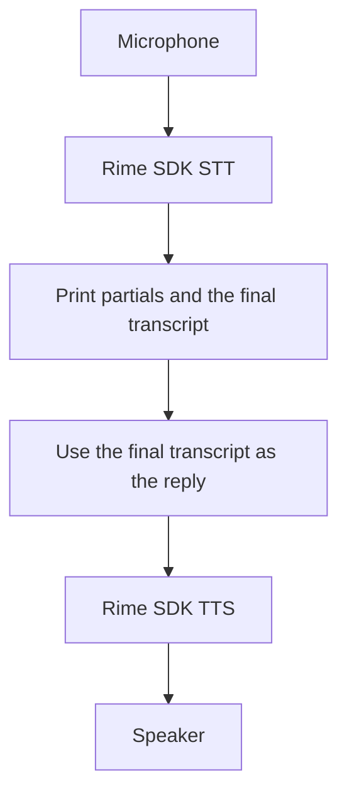

# Terminal voice echo in Python, JavaScript and Go

Use these examples to compare streaming STT through each Rime SDK. Each turn is:



The example speaks back what STT heard, so recognition errors stay visible.
It needs only `RIME_API_KEY`.

The SDK calls Rime's remote services. The terminal, microphone and speaker run
locally. No LiveKit/Pipecat adapter, browser, VAD or LLM provider is involved.

## Run this development checkout

Run one example at a time from the SDK repository root. These commands use the
local STT implementation; the examples' published SDK pins do not yet include it.
Keep `RIME_API_KEY` set in the environment. The scripts do not load `.env` files.

All three languages use the [SoX CLI](https://formulae.brew.sh/formula/sox) for
capture and file conversion. On macOS, replies are saved to a temporary WAV and
played with Apple's built-in `afplay`; the file is removed after playback or
cancellation. Playback starts after synthesis finishes. Linux streams replies
directly to SoX. This keeps each platform's audio path consistent across languages
without native Node/Go bindings.
The continuous Prism examples keep their existing PortAudio/browser audio paths.
The terminal examples target macOS and Linux. The Go example rejects microphone
mode on Windows; use `--input recording.wav`, optionally with `--output reply.wav`,
to test a recorded utterance there. Windows microphone operation in the Python
and JavaScript examples is not qualified.

On macOS:

```sh
brew install sox
# Install Go if needed: brew install go
```

Grant your terminal microphone access when macOS asks. Use the default input and
output devices selected in macOS System Settings → Sound. On Linux, install SoX
and its audio-device backend using your distribution's package manager.

Bluetooth headsets change audio modes when their microphone opens or closes.
SoX's macOS output driver can misplay audio across that transition, which is why
these examples use `afplay` for speaker output. If you still hear distortion,
select the MacBook microphone as input and retry; built-in speakers also avoid
the Bluetooth handoff. See [Apple's explanation of Bluetooth audio modes](https://support.apple.com/en-us/102217).

Prepare the development environment and local Node SDK link using the
[fresh-checkout setup](#set-up-a-fresh-checkout-before-publication), then run:

```sh
# Python
uv run --no-sync --project python python examples/python/stt/voice.py --language en

# JavaScript
npm --prefix examples/typescript run stt:voice -- --language en

# Go (GOWORK=off avoids inheriting a surrounding repository's Go workspace)
GOWORK=off go -C go run ./examples/voice --language en
```

1. Press **Enter** to start a turn. Wait for **Listening**.
2. Speak. `partial:` lines are complete replacement snapshots.
3. Press **Enter** to finish. Read `final:` and hear it spoken back.
4. Repeat, or type **q** at the next prompt to quit. **Ctrl+C** cancels immediately.

Capture starts after the STT service accepts the request. The microphone stops
before playback starts. Each language reuses one SDK client across turns.
A silence-only turn prints `No speech recognized.` without starting TTS. STT and
TTS request IDs are printed for troubleshooting. Device/service errors stop the
example and close audio processes; restart after correcting the error.

## Compare recognition options

The same flags work in all three versions:

| Flag | Meaning |
| --- | --- |
| `--language en` | Required spoken language, passed unchanged to STT and TTS |
| `--mode written` | Written normalization; use `verbatim` for spoken wording |
| `--term Rime` | Recognition hint; repeat the flag for multiple hints |
| `--voice clementine` | Optional Coda TTS voice; otherwise use the SDK default |
| `--input recording.wav` | Transcribe one audio file instead of capturing a turn |
| `--output reply.wav` | Save the reply instead of playing it; requires `--input` |

For example, append `--mode verbatim --term Rime --term Cassowary`. Try the same
phrase in each language implementation, including corrections, numbers, names,
pauses and silence. For Spanish, set `--language es`.

## Repeatable test without audio devices

These commands use the included speech fixture and save the response. They
exercise production STT and TTS without opening a microphone or speaker:

```sh
uv run --no-sync --project python python examples/python/stt/voice.py \
  --language en --input examples/audio/france.wav --output /tmp/rime-python-reply.wav

node examples/typescript/stt/voice.mjs \
  --language en --input examples/audio/france.wav --output /tmp/rime-js-reply.wav

GOWORK=off go -C go run ./examples/voice \
  --language en --input ../examples/audio/france.wav --output /tmp/rime-go-reply.wav
```

Paths are relative to each command's working directory. `go -C go` changes that
directory to `go/`; npm scripts run from `examples/typescript`, so use absolute
file paths with `npm run`. SoX converts input files to mono PCM16 at 16 kHz; SDK
TTS output is mono PCM16 at 24 kHz. Raw PCM files need format metadata and should
be converted to WAV before using `--input`.

Only successful completion confirms the saved reply; an error may leave a partial
file. Interactive recognition has a 120-second overall limit per utterance. TTS
has a 60-second limit, and device playback is bounded as well.

## Set up a fresh checkout before publication

Install the locked development dependencies, build Node's SDK, and link it into
the examples. The API dependencies include STT definitions; no local schema
build is required.

```sh
uv sync --project python --locked --dev
npm --prefix typescript ci
npm --prefix typescript run build
npm --prefix examples/typescript ci
npm --prefix examples/typescript install --no-save --package-lock=false "$PWD/typescript"
```

This leaves published dependency pins and lockfiles unchanged. Go downloads its
versioned API dependency through the normal module build. The examples exercise
the STT implementation in this checkout.

## Validation of this implementation

Each language passed production STT → TTS using the included recorded speech and
produced a nonempty mono PCM16 WAV at 24 kHz. A terminal test then exercised two
Enter-to-talk turns per language, checked that partials arrived before the end
key, and quit cleanly with `q`. That test replaced microphone/speaker access with
SoX file input/output; it did not record or play audio on physical devices.
Manual terminal testing on macOS confirmed that all three language examples
complete recognition and playback successfully. Device behavior still needs
qualification on other operating systems and audio configurations.
Native SDK tests plus simulated device processes cover lazy admission, source
failure without a successful final, silence, repeated turns and cancellation.
Playback tests check that the player receives the complete reply, generation
completion does not end playback, failed synthesis does not start the macOS
player, and cancellation/failure removes temporary audio and reaps the process.
