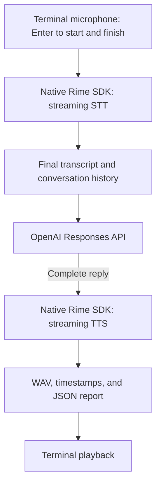

# Cascaded voice agent: Python, TypeScript, and Go

These local agents use the development SDK for **Rime STT → OpenAI → Rime TTS**.
They expose Mist v3 word timestamps and Coda custom pronunciations, including
server error messages and request IDs.

| Python | TypeScript | Go |
| --- | --- | --- |
| [voice.py](../python/agent/voice.py) | [voice.ts](../typescript/agent/voice.ts) | [main.go](../../go/examples/agent/main.go) |

The terminal agent uses Enter to start and finish recording. It
prints replacement STT transcripts, sends the final transcript and conversation
history to OpenAI, synthesizes the complete reply, saves a WAV and any timestamps,
then plays it. Terminal mode waits for the complete LLM reply
and complete audio before playback. It does not implement VAD or barge-in.



The default LLM is [GPT-4.1 mini](https://developers.openai.com/api/docs/models/gpt-4.1-mini).
The examples call the [Responses API](https://developers.openai.com/api/docs/guides/text)
over HTTPS, set `store: false`, limit output to 512 tokens, and keep the last ten
conversation turns in local memory. Use `--llm-model` or `OPENAI_MODEL` to change
models.

## Setup

Run these commands from the repository root. Requirements: Python 3.11+, `uv`,
Node.js 22+, and Go 1.24+. Install only the language dependencies you need.

```sh
uv sync --project python --locked --dev
npm --prefix typescript ci
npm --prefix examples/typescript ci

export RIME_API_KEY='your-rime-key'
export OPENAI_API_KEY='your-openai-key'
```

For terminal microphone/recorded input, install SoX (`brew install sox` on macOS,
or your Linux package manager) and grant your terminal microphone access.
Terminal microphone operation on Windows is unsupported; use recorded input.
Physical devices still need qualification on each OS.

The scripts read the process environment; they do not load `.env` files.
Direct TTS checks (`/say` or `--say`) need only `RIME_API_KEY`. Conversation turns
check for `OPENAI_API_KEY` before opening the microphone.

These commands use the SDK in this checkout. The TypeScript agent's tsconfig
maps `@rimelabs/sdk` to local source; the other examples' published dependency
is unaffected. Python uses the SDK development environment and Go uses the local
SDK module.

## Terminal conversations and deterministic checks

Choose one:

```sh
uv run --no-sync --project python python examples/python/agent/voice.py
npm --prefix examples/typescript run agent:voice
GOWORK=off go -C go run ./examples/agent
```

| Terminal input | Action |
| --- | --- |
| Enter | Start recording; press Enter again to finish and receive a reply. |
| `/ask TEXT` | Send typed text to OpenAI, then synthesize its reply. |
| `/say TEXT` | Synthesize exactly this text, bypassing STT and OpenAI. |
| `/reset` | Clear the conversation history. |
| `/quit` or `q` | Exit. |
| Ctrl+C | Cancel the active turn, close audio processes, and exit. |

Failed turns print the stage, error type/category, message, and available request
ID. The interactive loop stays usable after an error. One-shot commands exit
nonzero on errors. Only successful conversation turns enter the history.

## Mist v3 word timestamps

```sh
uv run --no-sync --project python python examples/python/agent/voice.py --model mistv3 --timestamps
npm --prefix examples/typescript run agent:voice -- --model mistv3 --timestamps
GOWORK=off go -C go run ./examples/agent --model mistv3 --timestamps
```

Try `/say Hello. I have 22 apples.` or ask the agent to repeat that sentence.
The terminal and JSON report show the alignment status and each word's start/end
in seconds relative to the saved audio. Normalization may turn `22` into multiple
spoken words. Compare those spans with the WAV in an audio editor.

Timestamps arrive after the audio stream finishes; this example does not show a
live playback cursor. A nonzero alignment status is displayed separately from
successful audio generation. If timestamp metadata is malformed or missing,
the turn records an error and retains the completed WAV for inspection.

To check the SDK's unsupported-model error, try `--model coda --timestamps` and
`/say Hello`. That validation is local, so it has no server request ID.

## Coda custom lexicon and pronunciation overrides

```sh
uv run --no-sync --project python python examples/python/agent/voice.py --model coda --lexicon "$PWD/examples/agent/lexicon.json"
npm --prefix examples/typescript run agent:voice -- --model coda --lexicon "$PWD/examples/agent/lexicon.json"
GOWORK=off go -C go run ./examples/agent --model coda --lexicon "$PWD/examples/agent/lexicon.json"
```

Use absolute paths as shown: npm and `go -C` change the working directory.
The shared [lexicon.json](lexicon.json) contains space-separated X-SAMPA:

```json
[
  {"spelling": "hello", "pronunciation": "h @ . \" l oU"},
  {"spelling": "read", "pronunciation": "\" r\\ E d"}
]
```

Try `/say Hello. Please read the 22 pages.` The override pronounces `read` like
`red`; compare with a run without `--lexicon`. For a full voice turn, ask the
agent to repeat the sentence and check that its printed reply contains the word.
The SDK applies the lexicon to TTS output, not to the user's transcription.

The file is reloaded before every turn. Edit it while the agent runs to compare
pronunciations without restarting. Each report stores the entries used for that
turn. The examples validate JSON shape; the server validates phonemes and stress.

## Pronunciation errors and recovery

Replace the lexicon path with `$PWD/examples/agent/lexicon-invalid.json`. That
fixture deliberately omits primary stress. Run `/say Hello` and check that:

1. The SDK reports an input error with the offending word and pronunciation issue.
2. The server request ID appears in the terminal and JSON report.
3. No successful WAV is left behind.
4. After replacing the invalid pronunciation with `h @ . " l oU`, another
   `/say Hello` succeeds in the same session.

Other useful negative checks: an unknown phoneme, malformed lexicon JSON, and
`--model mistv3 --lexicon PATH`. JSON errors happen locally; model/pronunciation
validation errors can come from the server. The agent passes the selected SDK
options through, so unsupported combinations are visible rather than discarded.

## Recorded input and direct TTS

Run a complete STT → LLM → TTS turn without microphone or speaker access:

```sh
uv run --no-sync --project python python examples/python/agent/voice.py --input "$PWD/examples/audio/france.wav" --model mistv3 --timestamps --no-playback
npm --prefix examples/typescript run agent:voice -- --input "$PWD/examples/audio/france.wav" --model mistv3 --timestamps --no-playback
GOWORK=off go -C go run ./examples/agent --input "$PWD/examples/audio/france.wav" --model mistv3 --timestamps --no-playback
```

SoX converts recorded input to mono 16 kHz PCM16. The included fixture says
“The capital of France is Paris.” These commands still require both API keys.

For a deterministic check requiring only Rime, replace `--input PATH` with
`--say 'Hello. I have 22 apples.'`. Add either `--model mistv3 --timestamps` or
`--model coda --lexicon PATH` to exercise the corresponding feature.

## Artifacts and options

Every run prints a unique artifacts directory, created under the OS temporary
directory by default. Use `--output-dir PATH` to choose its parent. Each turn
writes `turn-NNN.json` and, if synthesis completes, `turn-NNN.wav` (mono 24 kHz
PCM16). Reports contain transcript, reply, selected model/options, request IDs,
timestamps, and any error. These files contain your conversation and persist
until removed. Partial WAVs are deleted on failure or cancellation; completed
WAVs remain if timestamp handling or playback fails. A saved WAV confirms audio
generation, not that speakers played it.

All three implementations accept the same flags:

| Flag | Purpose |
| --- | --- |
| `--model coda\|mistv3` | TTS model; default `coda`. |
| `--language en` | STT and TTS language; use `en` or `es` for cascaded turns. |
| `--voice NAME` | Override the selected model's default voice. |
| `--timestamps` | Request final Mist v3 word timestamps. |
| `--complete-text` | Send the complete text using the `Synthesize` RPC. Audio still streams from the SDK and is saved before playback. |
| `--lexicon PATH` | JSON pronunciation entries, reloaded each turn. |
| `--llm-model NAME` | OpenAI model, default `OPENAI_MODEL` or `gpt-4.1-mini`. |
| `--instructions TEXT` | Replace the voice assistant's instructions. |
| `--mode written\|verbatim` | STT formatting mode. |
| `--term TEXT` | STT recognition hint; repeatable. |
| `--endpoint HOST:PORT` | Override the Rime TTS endpoint. |
| `--stt-endpoint HOST:PORT` | Override the Rime STT endpoint. |
| `--input PATH` | One recorded conversation turn, then exit. |
| `--say TEXT` | One direct TTS turn, then exit; mutually exclusive with `--input`. |
| `--no-playback` | Save output without opening the speakers. |
| `--output-dir PATH` | Parent for the new run's artifacts directory. |

## Automated checks

```sh
uv run --project python pytest python/tests/test_cascaded_agent.py
npm --prefix examples/typescript run check:agent
npm --prefix examples/typescript run test:agent
GOWORK=off go -C go test -race ./examples/agent
```

Tests use controlled Rime peers, simulated audio devices, and simulated OpenAI
responses. They cover conversation history, lexicon reload, errors, timestamps,
and cancellation without requiring API keys or audio hardware.

For an optional recorded-input check against production Rime STT and both TTS
models, with a simulated OpenAI response and no playback:

```sh
RIME_AGENT_LIVE=1 GOWORK=off go -C go test ./examples/agent -run TestLiveCascade -v
```

This check requires `RIME_API_KEY` and SoX but no OpenAI key.
Physical microphone/speaker behavior, pronunciation
listening comparisons, and a live OpenAI conversation must still be checked
manually.
